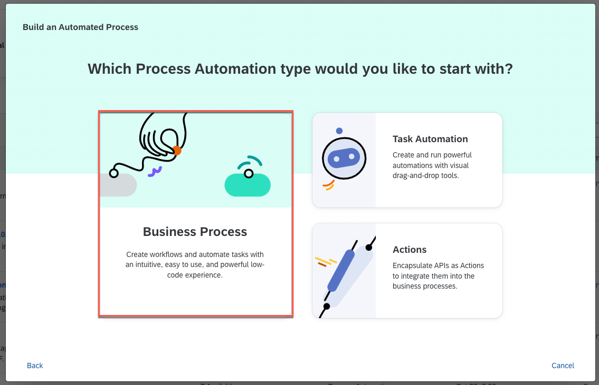
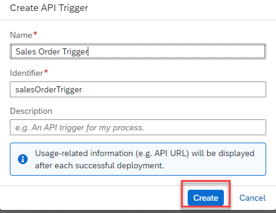
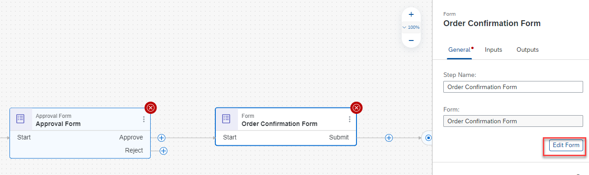
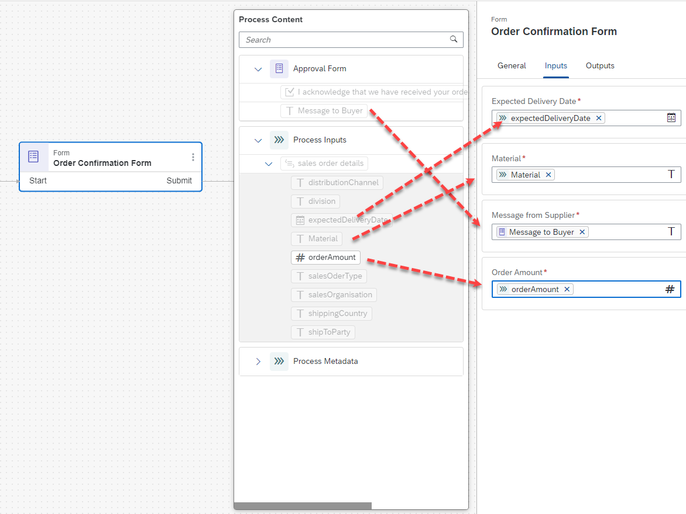
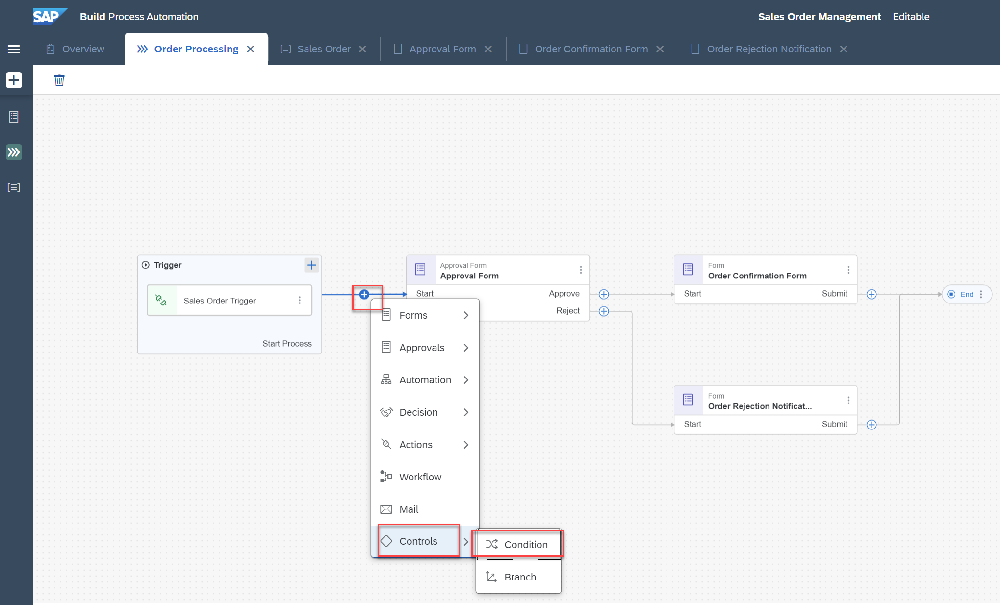
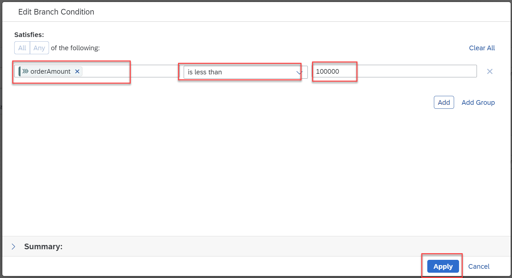
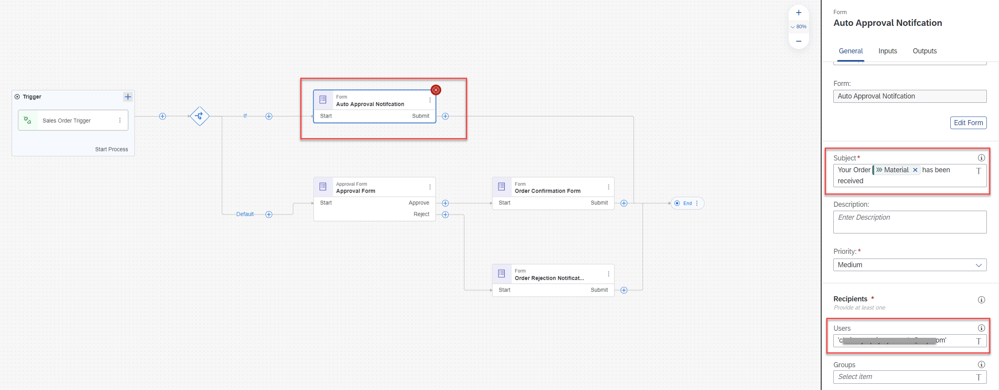
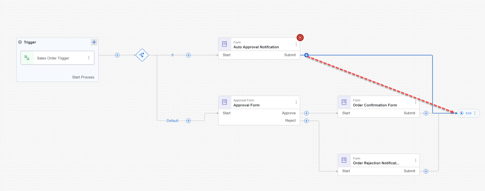

### Table of Contents
- [Create a business process project](#project)
- [Create a business process](#process)
- [Create an Data Type](#data)
- [Create and Configure Approval form](#aprrovalform)
- [Create and Configure Order Approval Notification form](#appnotification)
- [Create and configure Order Rejection Notification Form](#rejnotification)
- [Create and Configure Process Condition](#processcondi)
- [Create and Configure Auto Approval Notification](#autoapproval)
- [Save the Project](#save)

# Overview 

In this exercise, you will build your app in SAP Build Apps to upload invoices.

# Step 1  
## Create a business process project 

1. From [SAP Build Lobby](https://da160-96ork4sc-applicationdevelopment.lcnc.cfapps.eu10.hana.ondemand.com/lobby), click on <b>Create</b> and then select <b>Build Apps Project</b>. 

   | Username | Password    |
    | :------------- | :------------- |
    | AD160_XXX   where XXX is the user number   like AD160_000, AD160_001 etc.       | Acce$$teched22     |
    
 <b>1.</b>In the <b>Lobby</b>, choose <b>Create</b>.  The lobby is a central page for creating, accessing, and managing your projects in SAP Build. You can access business application processes, company configured templates, and other resources for your end-to-end business process.has context menu.   
 <b>2.</b> Pick <b>build an Automated Process</b>  
 <b>3.</b> Select <b>Buisness Process</b>  Business Process Projects are a collection of skills in SAP Build Process Automation. Projects are part of the internal business processes of a company and are defined based on business scenarios. A project can contain a set of processes, forms, automations and decisions, which are reusable artifacts  
 <b>4.</b> In the <b>Create a Buisness Process</b> dialog box, do the following: 
<ul>
  <li>Enter a <b>Project Name:</b> Sales Orders Management.</li>
  <li>Enter a <b>Short Description:</b> Sales Orders Management Project.</li>
  <li>Choose <b>Create</b></li>
</ul> 

# Step 2  
## Create a business process  

1. A new tab opens with the newly created project. 
2. In the <b>Create Process</b> dialog box, provide the following:
<ul>
  <li>Enter a  <b>Name: Order Processing</b></li>
  <li>Enter a <b>Description</b> for your process:A process to handle sales orders.</li>
  <li>Choose <b>Create</b></li>
</ul> 
Inside a project, you can create a process. This process is equivalent to a workflow in any business scenario. You can create this process from different skills such as forms, decisions, automations.  
 
The form <b>Identifier</b> field is auto-filled.

# Step 3  
##  Create an Data Type

1. Click on +->**Create**–>**DataType** .  
  
2. Create a datatype <b>Sales Order</b>  
  
3. Click on <b>New Field</b> to add new fields to the datatype <b>Sales Order.</b>  
  
4. Repeat the process to add all the fields of the type as shown below. 
<table>
  <tr>
    <th><b>Field Name</b></th>
    <th><b>Type</b></th>
  </tr>
  <tr>
    <td>material</td>
    <td>String</td>
  </tr>
  <tr>
    <td>orderAmount</td>
    <td>Number</td>
  </tr>
  <tr>
    <td>shipToParty</td>
    <td>String</td>
  </tr>
  <tr>
    <td>salesOrderType</td>
    <td>String</td>
  </tr>
  <tr>
    <td>salesOrganisation</td>
    <td>String</td>
  </tr>
  <tr>
    <td>distributionChannel</td>
    <td>String</td>
  </tr>
  <tr>
    <td>shippingCountry</td>
    <td>String</td>
  </tr>
  <tr>
    <td>expectedDeliveryDate</td>
    <td>Date</td>
  </tr>
  <tr>
    <td>division</td>
    <td>String</td>
  </tr>
</table> 
  Your final data type looks as below.  
    

# Step 4  
## Create and Configure API trigger
 
1. Click on <b>+–> API –> New API Trigger.</b>    
2. Enter the name as <b>Sales Order Trigger</b>.  
  
3. Choose <b>Inputs</b>. Then choose <b>Configure</b> to configure inputs.  
  
4. In the <b>Configure Process Inputs</b> window, choose <b>Add Input</b> to add parameters.  
Add the following parameter 
<table>
  <tr>
    <th><b>Name</b></th>
    <th><b>Type</b></th>
  </tr>
  <tr>
    <td>salesorderdetails</td>
    <td>SalesOrder</td>
  </tr>
</table> <b>Apply</b> changes.  
 
5.<b> Save</b> the project. 

# Step 5  
## Create and Configure Approval form
  
1. Click on <b>+–> Approval–> New Approval Form.</b>    
2. Enter the name as <b>Approval Form.</b>  
  
3. Click on <b>Edit form.</b>  
4. Design the form by dragging and dropping the corresponding form elements as shown below. 
<table>
  <tr>
    <th><b>Form Fields</b></th>
    <th><b>Field Settings with label</b></th>
    <th><b>Configuration(Read Only)</b></th>
  </tr>
  <tr>
     <td>Approve Sales Order</td>
    <td>HeadLine1</td>
    <td></td>
  </tr>
  <tr>
     <td>A new order has been received.Please review and confirm whether the requirements canbe met or not.</td>
    <td>Paragraph</td>
    <td></td>
  </tr>
  <tr>
     <td>Material</td>
    <td>Text</td>
    <td>X</td>
  </tr>
  <tr>
     <td>Order Amount</td>
    <td>Number</td>
    <td>X</td>
  </tr>
  <tr>
     <td>Expected Delivery Date</td>
    <td>Date</td>
    <td>X</td>
  </tr>
  <tr>
     <td>I acknowledge that we have received your order and will process it based on the availability. </td>
    <td>Checkbox</td>
    <td></td>
  </tr>
  <tr>
     <td>Message to Buyer</td>
    <td>Text Area</td>
    <td>X</td>
  </tr>
</table> 
  
5. <b>Save</b> the form  
6. Click on the <b>Approval Form</b> and configure the <b>Subject</b> and <b>Recipients.</b> 
<ul>
  <li>Enter <b>Please review</b></li>
  <li>Select <b>Material</b>from the sales order details</li>
</ul> 
Enter your login credentials (emailID) in the <b>Recipients</b> section. 
  
7. Configure the inputs of <b>Approval Form </b>.    Navigate to Inputs and map the fields accordingly.   

# Step 6  
## Create and Configure Order Approval Notification form
 
1. Click on +–>**Forms**–>**New Form**.  
  
2. Enter the name as <b>Order Confirmation Form.</b>    
3. Click on <b>Edit form</b>    
4. Design the form by dragging and dropping the corresponding Form elements as shown below. 
<table>
  <tr>
    <th><b>Form Fields</b></th>
    <th><b>Field Settings with label</b></th>
    <th><b>Configuration(Read Only)</b></th>
  </tr>
  <tr>
     <td>Headline 1</td>
    <td>Order Confirmation</td>
    <td></td>
  </tr>
  <tr>
     <td>Paragraph</td>
    <td>our order has been received and accepted for delivery. We will send you the details as soon as the order is shipped. You can find the details of your order below, please review and verify your request:</td>
    <td></td>
  </tr>
  <tr>
     <td>Text Area</td>
    <td>Message from the supplier:</td>
    <td>X</td>
  </tr>
  <tr>
     <td>Text</td>
    <td>Material Name</td>
    <td>X</td>
  </tr>
  <tr>
     <td>Number</td>
    <td>Order Amount</td>
    <td>X</td>
  </tr>
  <tr>
     <td>Date</td>
    <td>Expected Delivery Date</td>
    <td>X</td>
  </tr>
  <tr>
     <td>Paragraph</td>
    <td>Please press the SUBMIT button to acknowledge the order status.</td>
    <td></td>
  </tr>
  </table>   
  5. <b>Save</b> the form.  
  6. Click on the <b>Order Approval Form</b> and configure the <b>Subject</b> and <b>Recipients.</b> 
  <ul>
      <li>Enter <b>Your Order</b></li>
      <li>Select <b>Material</b>from the sales order details.</li>
      <li>Enter <b>has been approved.</b></li>
  </ul> 
  Enter your login credentials (emailID) in the <b>Recipients</b> section.   
  7. Configure the inputs of <b> Order Approval Form.</b> Navigate to Inputs and map the fields accordingly.   

# Step 7 
## Create and Configure Order Rejection Notification Form  
1. To add the new rejection form, you will use the <b>Duplicate</b> feature. Select the <b>Overview.</b>
<ul>
      <li>Find <b>Order Confirmation Form</b>under the Artifacts section and select three dots (**…**).</li>
      <li>Choose <b>Duplicate</b></li>
  </ul>
   
2. In the duplicate artifact pop-up window change the name to <b>Order Rejection Notification</b> and select <b>Duplicate</b>. 
   
3. The form is automatically opened in the form builder. Change the order rejection form in the form builder to reflect the data for rejection case.  
<table>
  <tr>
    <th><b>Form Fields</b></th>
    <th><b>Field Settings with label</b></th>
  </tr>
  <tr>
    <td>Headline 1</td>
    <td>Order Rejection</td>
  </tr>
   <tr>
     <td>Paragraph</td>
    <td>We are sorry to inform you that your order cannot be accepted. Any inconvenience caused due to the refusal of the order is regretted. You can find the reason of the rejection and the details of your order below, please confirm the request:</td>
  </tr></table>   
  4. <b>Save</b> the form. 
  5. Go back to the process builder and add the order rejection notification form to the process. Select <b>Approval Form</b> and choose + option for the <b>Reject.</b> Choose <b>Forms</b> and select <b>Order Rejection Form.</b>
   
  6. Configure the order rejection form. In the General section configure in the <b>Subject</b> box: 
  <ul>
      <li>Enter <b>Your Order</b> </li>
      <li>Select <b>Order Number</b> from the Order Processing Form</li>
      <li>Enter <b>is rejected by the supplier</b></li>
  </ul> 
  7. Under Recipients Enter your login credentials(emailID)    
  8. Configure the <b>Inputs</b>  section. 
  <table>
  <tr>
    <th><b>Form Input Fields</b></th>
    <th><b>Process Content Entry</b></th>
  </tr>
  <tr>
    <td>Expected Delivery Date</td>
    <td>Expected Delivery Date</td>
  </tr>
  <tr>
    <td>Message from the supplier</td>
    <td>Message to buyer</td>
  </tr>
  <tr>
    <td>Order Amount</td>
    <td>Order Amount</td>
  </tr>
  <tr>
    <td>Material Name</td>
    <td>Material Name</td>
  </tr>
  </table> 
     
  9. Finally, connect the outgoing flow of the order rejection form to the <b>End</b> activity. 
     
  10. <b>Save</b> your work. 
     With this you have completed the process design of your business process. You have experienced building a process in a completely no-code environment and with no technical know-how. You used the process builder to create a one-step approval process with the API trigger , approval form and notification forms.  

# Step 8 
## Create and Configure Process Condition  
Once the process with forms is designed, define which process flow should run based on if/else condition criteria. 
1. To add a condition to a process open the <b>Process Builder</b>. Choose + next to the Trigger. Select <b>Controls</b> then <b>Condition.</b>    
2. To configure the condition, choose <b>Open Condition Editor.</b>   Process content will contain a list of attributes that have been defined in previous skills. For example: in the screenshot, you can see attributes from the API trigger . You will use this process content to configure different skills during business process modelling. 
3.  Edit your branch condition: 
<ul>
  <li>Set <b>Order Amount</b>from the process content</li>
  <li>Select is <b>less than</b></li>
  <li>Enter <b> 100000</b>as the value</li>
  <li>Choose <b>Apply</b></li>
</ul>   
You have configured your <b>if</b> branch to: <b>if Order Amount is less than 100000.</b>  
4. Link your <b>Default</b> branch to <b>Approval Form.</b>
   
With this process condition, only the sales order above a specific amount will be sent for approval and the rest will be auto-approved.  
5. Decide the process flow if the condition criteria is met. First, you have to remove the connection from If-route to Approval Form and then create a new form to notify the requester of the auto-approval.
   

# Step 9 
## Create and Configure Auto Approval Notification  

1. To create the new form, add the <b>New Form</b> from the <b>If-route.</b>    
2. In the Create Form window: 
<ul>
  <li>Enter the Name:<b> Auto Approval Notification</b></li>
  <li>Enter a Description: <b>Notification form to inform auto approval of the sales order.</b></li>
  <li>Choose <b>Create</b></li>
</ul>   
3. Edit the form using <b>Edit Form</b> Button .Design the notification form, the same way as in the previous steps, to send another notification to the requester about auto-approval.Add <b>Layout fields:</b>  
<table>
  <tr>
    <th><b>Form Fields</b></th>
    <th><b>Field Settings with label</b></th>
    <th><b>Configuration (Read Only)</b></th>
  </tr>
  <tr>
     <td>Headline 1</td>
    <td>Automatic Order Confirmation</td>
     <td></td>
  </tr>
  <tr>
     <td>Paragraph</td>
    <td>Your order has been received and we will send you the details as soon as the order is shipped. You can find the details of your order below, please review and verify your request:</td>
     <td></td>
  </tr>
   <tr>
     <td>Paragraph</td>
    <td>Your Sale’s Order Details:</td>
     <td></td>
  </tr>
   <tr>
     <td>text</td>
    <td>Material Name</td>
     <td>X</td>
  </tr>
   <tr>
     <td>Number</td>
    <td>Order Amount</td>
     <td>X</td>
  </tr>
   <tr>
     <td>Date</td>
    <td>Expected Delivery Date</td>
     <td>X</td>
  </tr>
   <tr>
     <td>Paragraph</td>
    <td>Please press the SUBMIT button to acknowledge the order status</td>
     <td></td>
  </tr>
  </table> 
    
  4. <b>Save</b> your work.  
  5. Go back to the process builder and configure the auto approval form.
  6. Configure the <b>General section</b>. Under Subject:
  <ul>
  <li>Enter: Your order</li>
  <li>Choose:<b>Order Number</b> from Order Processing Form</li>
  <li>Enter:<b>has been successfully received</b> </li>
</ul> 
   Under Recipients Enter your login credentials (emailID) 
    
  7. Configure the <b>Inputs</b> section. 
<table>
  <tr>
    <th><b>Form Input Fields</b></th>
    <th><b>Process Content Entry</b></th>
  </tr>
  <tr>
     <td>Material Name</td>
    <td>Material Name</td>
  </tr>
   <tr>
     <td>Order Amount/td>
    <td>Order Amount</td>
  </tr>
   <tr>
     <td>Expected Delivery Date</td>
    <td>Expected Delivery Date</td>
  </tr>
  </table>
     
 8. Connect the outgoing flow of the auto-approval form to the <b>End</b> activity.    

# Step 10 
## <style="color:blue">Save the Project  
   
<b>Save</b> your work. 

This completes the process design with condition criteria that will decide what process flow is executed and whether there will be an auto-approval or a one-step approval route. 

2. Under <b>Project Name</b>, enter <b><i>"Invoice AD160-XXX"</b></i>, replace XXX with your user ID. For example, <i>"Invoice AD160-087"</i>. Click on <b>Create</b> to start building your application.
  

## Create UI 

1. You will be redirected to <b>Build Apps Composer</b>, which is like an IDE for SAP Build Apps. On the canvas, you can already see a <b>Title</b> and a <b>Text</b> component.  

2. Click on “<i>Headline</i>” on the canvas to select the <b>Title</b> component.
Now, the <b>PROPERTIES</b> tab on the right-hand side will show the properties of the <b>Title</b> component where you can modify it.  Under <b>Content</b>, enter “<i>Invoice Approval.</i>”  

3. Select the <b>Text</b> component, modify the <b>Content</b> under the <b>PROPERTIES</b> tab on the right-hand side to "<i>Enter your name and upload your invoice</i>".  

4. Drag and drop an <b>Input field</b> from the <b>UI Component</b> library into the canvas.   

5. Under the <b>PROPERTIES</b> tab of the <b>Input field</b>, clear the <b>Label</b> and change the <b>Placeholder text</b> to "<i>Enter your name</i>".  

6. Drag and drop a <b>Button</b> component from the component library on the left-hand side into the canvas.  Change the <b>Label</b> on the button in the <b>PROPERTIES</b> tab of the button component to “<i>Upload your Invoice</i>”.  

7. Drag and drop an <b>Image</b> component into the canvas.  

8. Switch to <b>VARIABLES</b> view.

    > In <b>Variables view</b>, you can create variables which can store information temporarily.

    

9. Create an <b>App variable</b> by clicking on <b>ADD APP VARIABLE</b> and rename it to "<i>name</i>".  

10. Add another <b>App variable</b> and rename it to "<i>Invoicescan</i>".  

11. Change the <b>Variable value type</b> of <b>Invoicescan</b> to <b>Local filesystem path</b>.  

12. Add another <b>App variable</b> and rename it to <b>filename</b>.  

13. Switch back to <b>VIEW</b>.   

14. Under the <b>PROPERTIES</b> tab of the <b>Input field</b> component, open the binding menu for <b>Value</b> by clicking on the "<b>X</b>" icon.  

15. The binding menu will pop-up. Select <b> Data and Variables</b>.  

16. Select <b>App variable</b>.  

17. Select <b>name</b> in the list of <b>App variable</b> available.  

18. Click on the <b>SAVE</b> button to save the binding to the component value.  

19. A variable can be binded to this image component. Open the binding menu of the <b>Image</b> component under <b>PROPERTIES</b> on the right-hand side.  

20. The binding menu will pop-up. Select <b>Data and Variables</b>.  

21. Select <b>App variable</b>.  

22. Select <b>Invoicescan</b> under the list of available app variables and click on <b>SAVE</b> to save the binding to the <b>Image</b> component.  

23. Drag and drop another <b>Button</b> component from the component library into the canvas and rename the <b>Label</b> to <i>Submit</i>.  

24. The <b>Submit</b> button should be visible only after the invoice is selected. Click on <b>ADVANCED PROPERTIES</b> to change the visibility properties of the button. Open the binding menu for the visibility properties.  

25. Select <b>Formula</b>.  

26. In the formula bar enter the following formula:

    <pre>IF(IS_EMPTY(appVars.Invoicescan),false,true)</pre>

    > This formula checks if the <b>InvoiceScan</b> page variable is empty, then the output will be false and component will be disabled. If the <b>InvoiceScan</b> page variable has some value, the output will change to true, and the component will be displayed.

    Click on <b>SAVE</b>.

    

26. Click on <b>SAVE</b>.  

27. Click on <b>SAVE</b> on the top right corner to save the UI created so far.  

## Data Connection 

Now, your application will be connected to Document Management System and SAP Process Automation. First, you should enable BTP authentication to connect your app to SAP Process Automation via Destinations.

1. Choose <b>AUTH</b> tab on the top of the screen.  

2. Select <b>ENABLE AUTHENTICATION</b>.  

3. Select <b>SAP BTP authentication</b>.  

4. Click on the <b>OK</b> button to enable the BTP authentication to your application.   

5. Click on <b>DATA</b> tab.  

6. Under <b>SAP AppGyver classic data entities</b>, click on <b>CREATE DATA ENTITY</b> and select <b>SAP BTP destination REST API integration</b>.  

7. As the <b>BTP destination name</b>, select <b>AppGyver_SPA</b>.  

8.  Under <b> Data resource name</b>, a name can be given to this data connection, like "<i>SendtoSPA</i>".  

9. Under <b>Resource schema</b>, click on <b>+ ADD NEW</b> to create a schema. Name the new schema to "<i>filename</i>" and select the <b>Field type</b> as <b>Text</b>.
Choose <b>ADD.</b>

    > Schema is structure of the data. A schema is created which is similar to the Data base. In this scenario the data base is Document Management System (DMS), and schema should be created matching the schema in DMS.

      

10. Similarly, add three other schema with the following names:
  - "<i>foldername</i>"
  - "<i>employeename</i>"
  - "<i>employeemail</i>"

    Select the <b>Field type</b> for all of them as <b>Text</b>.  
    

11. Select the <b>create</b> tab, and enable it.  

12. Open the binding menu for <b>Request headers</b> by clicking on the <b>X</b> icon.  

13. In the binding menu, select <b>List of values</b>.  

14. Click on <b>Add value</b>, and enter the following values:
    - <b>Header name</b>: <i> Content-Type</i> 
    - <b>Header value</b>:<i> application/json</i>

    Click on <b>SAVE</b>.

    

15. <b>Request body mapper</b> value will be binded after creating the process using SAP BUILD PROCESS AUTOMATION.

    Click on <b>SAVE DATA RESOURCE</b>. The connection between your Application and Process is created using Destinations.   
    

16. Add another data entity to store the invoice in Document Management Service.
    > For this data connection, Destinations are not used because, the response from Document Management Service is in XML format. AppGyver can only read JSON responses.  Because of this reason Document Management Service is connected using DIRECT REST API.

    Click on <b> CREATE DATA ENTITY</b> and now select <b>REST API direct integration</b>.

      

17. In the <b>BASE</b> tab of the API configuration enter the following values:
  - <b>Resource ID</b> : Documentupload
  - <b>Resource URL</b>: https://end-to-end-demo-lcnc-trial.integrationsuitetrial-apim.eu10.hana.ondemand.com/end-to-end-demo-lcnc/httpjsonv2/docrepouploadteched
    

    

18. Select the <b>CREATE RECORD</b> tab and enable it.  

19. Switch to the <b>SCHEMA</b> tab. 
 Under <b>Create record (POST) request schema</b> use the drop down list and select <b>Custom schema</b>.  

20. Click on <b>ADD PROPERTY</b>. Rename the <b>Key</b> in <b>PROPERTIES</b> to “<i>base64</i>”.  

21.  Add another property and rename it to “<i>fileName</i>” and click on <b>SAVE DATA ENTITY</b>.   

22. Click on <b>SAVE</b> on the top right corner of the screen.  

## Create Logic for Upload button 

1. Go to the **UI CANVAS**. Select the <b>Upload your Invoice</b> button and click on the grey bar on the bottom to open the logic composer.   

2. By default, the trigger event will be <b>Component tap</b>. 
Now you will download a new component from the <b>MARKETPLACE</b>.

    > MARKETPLACE</b> contains hundreds of pre-built visual and logic components, which can be installed and used with minimum or no customization.
  Find more information on <a href="https://docs.appgyver.com/docs/marketplace?highlight=Market%20place">MARKETPLACE here</a>.

    

3. Click on the <b>MARKETPLACE</b> search bar. You may search for “<i>pick image</i>”. Select the <b>Pick image from library </b>component.  

4. Click on <b>INSTALL</b> to install the logic component in the library.  

5. Drag and drop the <b>Pick image from library</b> under the <b>INSTALLED</b> tab into the logic canvas. Connect output node of the <b>Component tap</b> logic component with the <b>Pick image
from library</b> component.  

    > To do so, click on the node of the <b>Pick image from library</b> component. Now pull the node, creating a line that you can link to the node of the <b>Component tap</b> logic component.

    

6. From the <b>CORE</b> tab of the component library drag and drop the <b>Set app variable</b> component into the canvas. In the same way, connect the node of the <b>Pick image from library</b> component to the <b>Set app variable</b> component.  

7. In the <b>PROPERTIES</b> tab of the <b>Set app variable</b>, select the variable <b>Invoicescan</b>.  

8. Open the binding menu for <b>Assigned value</b>.   

9. Select <b>Output value of another node</b>.  

10. You can see the available nodes in the canvas. Select <b>Pick image from library</b> node. A list of outputs from node will appear. Select <b>
path</b>.  

11. Click on <b>SAVE</b>.  

## Create Logic for Submit button 

1. Select the <b>Submit</b> button and click on the grey bar on the bottom to open the logic composer.  

2. You will download a new component from the <b>MARKETPLACE</b>.  

3. In the search bar, search for “<i>base64</i>” and select <b>Convert file to base64</b>
and install it.   

4. Drag and drop <b>Convert file to base64</b> into the logic canvas.  

5. Connect the nodes of <b>Component tap</b> and <b>Convert file to base64</b>.
Open the binding menu for <b>Source file URL</b> of the <b>Convert file to base64</b> logic component.  

6. In the binding menu select <b>Data and Variables</b> and select <b>App variable</b>.  

7. Select <b>Invoicescan</b> and click on <b>SAVE</b>.  

8. From the <b>CORE</b> tab, drag and drop <b>Set app variable </b> component from the component library and connect the node with <b>Convert file to base64</b>.
 In the <b>PROPERTIES</b> tab, make sure the variable is <b>filename</b>, and now open the binding menu for the <b>Assigned value.</b>  

9. Select <b>Formula</b> in the binding menu.  

10. Open the formula editor. Select <b>App variables</b> and double click on <b>appVars.name</b> to use the function.  

11. Add the following values.
 <pre>+TIMESTAMP()+".png"</pre>
The overall formula will look like the following:  
 <pre>appVars.name+TIMESTAMP()+".png"</pre>
Click on <b>SAVE</b>.  

12. Drag and drop <b>Create record</b> logic component into the logic canvas and connect the nodes with <b>Set app variable</b> component. In the <b>PROPERTIES</b> tab of the logic component check if the <b>Resource name</b> is <b>Documentupload</b>. Open the binding menu of <b>Record properties</b>.  

13. In the binding menu, select <b>Object with properties</b>.  

14.  Open the binding menu for <b>base64</b>.  

15. In the binding menu select <b>Formula</b> and open the formula editor. In the formula editor, enter the following formula:
 <pre>REPLACE_ALL(outputs["Convert file to base64"].base64,"data:image/png;base64,","")</pre>
Click on <b>SAVE</b> button.  

16. Open the binding menu for <b>fileName</b>.  

17. In the binding menu, select <b>Data and Variables</b> and select <b>App variable</b>. Select the variable <b>filename</b> and click on <b>SAVE</b>.  

18. Save the bindings.  

19. Drag and drop another <b>Create record</b> logic component into the logic canvas and connect the nodes with <b>Create record</b> component.
Change the <b>Resource name</b> to <b>SendtoSPA</b>.						
Open the binding menu for <b>Record</b> properties.  

20. In the binding menu, select <b>Object with properties</b>.  

21. Open the binding menu for <b>filename</b>.  

22. In the binding menu, select <b>Data and Variables</b>, then choose <b>App variable</b> and finally the variable <b>filename</b>. 
Click on <b>SAVE</b>.  

23. The folder name will be static, enter the value “<i>Invoices</i>”.   

24. Open the binding menu for the <b>employeename</b>.  

25. In the binding menu, select <b>Data and Variables</b>. Select <b>App variables</b> and then choose <b>name</b>.  

26. The <b>employeemail</b> will be static, enter the email provided to you "ad160-XXX@education.cloud.sap".  For example: "<i>ad160-087@education.cloud.sap</i>"  

27. Save the bindings.  

28. Drag and drop a <b>Toast</b> component.

    > This component displays a message. 

    Connect the nodes of the <b>Create record</b> component to the <b>Toast</b> component. Under the properties of the <b>Toast</b> component, enter "<i>Your Invoice has been submitted</i>" as the <b>Toast message</b>.  
    

29. **Save** your work.

## Summary 

You have build an app and completed the below steps.

Continue to - [Exercise 2 - Install and configure Desktop Agent 3](../2_InstallDesktopAgent3/Readme.md) and get started with SAP Build Process Automation.
