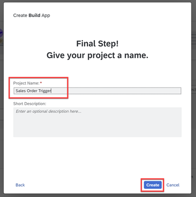
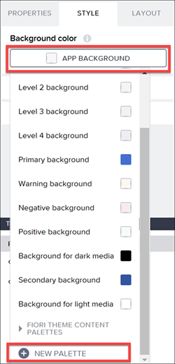
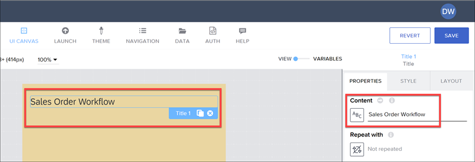
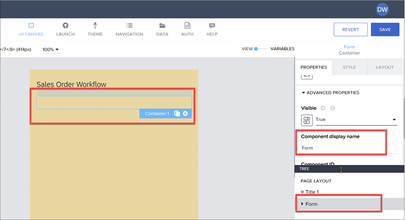
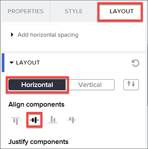
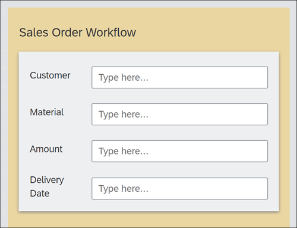
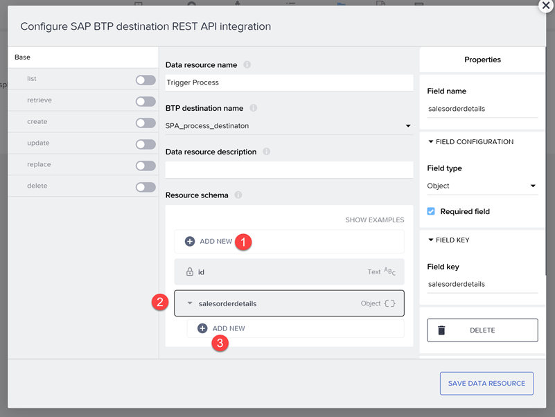
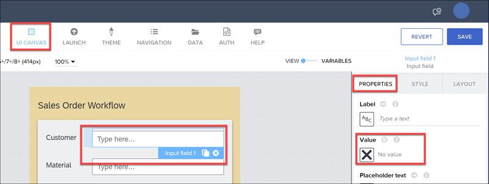
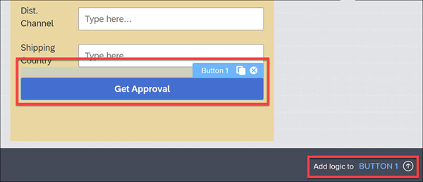
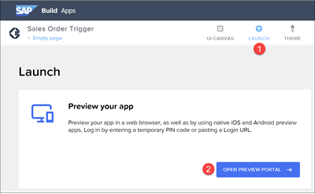

<<<<<<< Updated upstream
### Table of Contents
- [Create a SAP BUid App](#project)
- [Create a business process](#process)
- [Create an Data Type](#data)
- [Create and Configure Approval form](#aprrovalform)
- [Create and Configure Order Approval Notification form](#appnotification)
- [Create and configure Order Rejection Notification Form](#rejnotification)
- [Create and Configure Process Condition](#processcondi)
- [Create and Configure Auto Approval Notification](#autoapproval)
- [Save the Project](#save)

<<<<<<< Updated upstream
# Overview 

In this exercise, you will build your app in SAP Build Apps to upload invoice.
=======
## Table of Contents
- [Create a business process projects](#project)
- [Create a business process](#process)
- [Create an Data Type](#data)
- [Create and Configure Approval form](#aprrovalform)
- [Create and Configure Order Approval Notification form](#appnotification)
- [Create and configure Order Rejection Notification Form](#rejnotification)
- [Create and Configure Process Condition](#processcondi)
- [Create and Configure Auto Approval Notification](#autoapproval)
- [Save the Project](#save)

# Overview 

In this exercise, you will build your app in SAP Build Apps to upload invoices.

## Create a business process project 

1. From [SAP Build Lobby](https://da160-96ork4sc-applicationdevelopment.lcnc.cfapps.eu10.hana.ondemand.com/lobby), click on <b>Create</b> and then select <b>Build Apps Project</b>. 

   | Username | Password    |
    | :------------- | :------------- |
    | AD160_XXX   where XXX is the user number   like AD160_000, AD160_001 etc.       | Acce$$teched22     |
    
 
 

2. Under <b>Project Name</b>, enter <b><i>"Invoice AD160-XXX"</b></i>, replace XXX with your user ID. For example, <i>"Invoice AD160-087"</i>. Click on <b>Create</b> to start building your application.
  

## Create UI 

1. You will be redirected to <b>Build Apps Composer</b>, which is like an IDE for SAP Build Apps. On the canvas, you can already see a <b>Title</b> and a <b>Text</b> component.  

2. Click on “<i>Headline</i>” on the canvas to select the <b>Title</b> component.
Now, the <b>PROPERTIES</b> tab on the right-hand side will show the properties of the <b>Title</b> component where you can modify it.  Under <b>Content</b>, enter “<i>Invoice Approval.</i>”  

3. Select the <b>Text</b> component, modify the <b>Content</b> under the <b>PROPERTIES</b> tab on the right-hand side to "<i>Enter your name and upload your invoice</i>".  

4. Drag and drop an <b>Input field</b> from the <b>UI Component</b> library into the canvas.   

5. Under the <b>PROPERTIES</b> tab of the <b>Input field</b>, clear the <b>Label</b> and change the <b>Placeholder text</b> to "<i>Enter your name</i>".  

6. Drag and drop a <b>Button</b> component from the component library on the left-hand side into the canvas.  Change the <b>Label</b> on the button in the <b>PROPERTIES</b> tab of the button component to “<i>Upload your Invoice</i>”.  

7. Drag and drop an <b>Image</b> component into the canvas.  

8. Switch to <b>VARIABLES</b> view.

    > In <b>Variables view</b>, you can create variables which can store information temporarily.

    

9. Create an <b>App variable</b> by clicking on <b>ADD APP VARIABLE</b> and rename it to "<i>name</i>".  

10. Add another <b>App variable</b> and rename it to "<i>Invoicescan</i>".  

11. Change the <b>Variable value type</b> of <b>Invoicescan</b> to <b>Local filesystem path</b>.  

12. Add another <b>App variable</b> and rename it to <b>filename</b>.  

13. Switch back to <b>VIEW</b>.   

14. Under the <b>PROPERTIES</b> tab of the <b>Input field</b> component, open the binding menu for <b>Value</b> by clicking on the "<b>X</b>" icon.  

15. The binding menu will pop-up. Select <b> Data and Variables</b>.  

16. Select <b>App variable</b>.  

17. Select <b>name</b> in the list of <b>App variable</b> available.  

18. Click on the <b>SAVE</b> button to save the binding to the component value.  

19. A variable can be binded to this image component. Open the binding menu of the <b>Image</b> component under <b>PROPERTIES</b> on the right-hand side.  

20. The binding menu will pop-up. Select <b>Data and Variables</b>.  

21. Select <b>App variable</b>.  

22. Select <b>Invoicescan</b> under the list of available app variables and click on <b>SAVE</b> to save the binding to the <b>Image</b> component.  

23. Drag and drop another <b>Button</b> component from the component library into the canvas and rename the <b>Label</b> to <i>Submit</i>.  

24. The <b>Submit</b> button should be visible only after the invoice is selected. Click on <b>ADVANCED PROPERTIES</b> to change the visibility properties of the button. Open the binding menu for the visibility properties.  

25. Select <b>Formula</b>.  

26. In the formula bar enter the following formula:

    <pre>IF(IS_EMPTY(appVars.Invoicescan),false,true)</pre>

    > This formula checks if the <b>InvoiceScan</b> page variable is empty, then the output will be false and component will be disabled. If the <b>InvoiceScan</b> page variable has some value, the output will change to true, and the component will be displayed.

    Click on <b>SAVE</b>.

    

26. Click on <b>SAVE</b>.  

27. Click on <b>SAVE</b> on the top right corner to save the UI created so far.  

## Data Connection 

Now, your application will be connected to Document Management System and SAP Process Automation. First, you should enable BTP authentication to connect your app to SAP Process Automation via Destinations.

1. Choose <b>AUTH</b> tab on the top of the screen.  

2. Select <b>ENABLE AUTHENTICATION</b>.  

3. Select <b>SAP BTP authentication</b>.  

4. Click on the <b>OK</b> button to enable the BTP authentication to your application.   

5. Click on <b>DATA</b> tab.  

6. Under <b>SAP AppGyver classic data entities</b>, click on <b>CREATE DATA ENTITY</b> and select <b>SAP BTP destination REST API integration</b>.  

7. As the <b>BTP destination name</b>, select <b>AppGyver_SPA</b>.  

8.  Under <b> Data resource name</b>, a name can be given to this data connection, like "<i>SendtoSPA</i>".  

9. Under <b>Resource schema</b>, click on <b>+ ADD NEW</b> to create a schema. Name the new schema to "<i>filename</i>" and select the <b>Field type</b> as <b>Text</b>.
Choose <b>ADD.</b>

    > Schema is structure of the data. A schema is created which is similar to the Data base. In this scenario the data base is Document Management System (DMS), and schema should be created matching the schema in DMS.

      

10. Similarly, add three other schema with the following names:
  - "<i>foldername</i>"
  - "<i>employeename</i>"
  - "<i>employeemail</i>"

    Select the <b>Field type</b> for all of them as <b>Text</b>.  
    

11. Select the <b>create</b> tab, and enable it.  

12. Open the binding menu for <b>Request headers</b> by clicking on the <b>X</b> icon.  

13. In the binding menu, select <b>List of values</b>.  

14. Click on <b>Add value</b>, and enter the following values:
    - <b>Header name</b>: <i> Content-Type</i> 
    - <b>Header value</b>:<i> application/json</i>

    Click on <b>SAVE</b>.

    

15. <b>Request body mapper</b> value will be binded after creating the process using SAP BUILD PROCESS AUTOMATION.

    Click on <b>SAVE DATA RESOURCE</b>. The connection between your Application and Process is created using Destinations.   
    

16. Add another data entity to store the invoice in Document Management Service.
    > For this data connection, Destinations are not used because, the response from Document Management Service is in XML format. AppGyver can only read JSON responses.  Because of this reason Document Management Service is connected using DIRECT REST API.

    Click on <b> CREATE DATA ENTITY</b> and now select <b>REST API direct integration</b>.

      

17. In the <b>BASE</b> tab of the API configuration enter the following values:
  - <b>Resource ID</b> : Documentupload
  - <b>Resource URL</b>: https://end-to-end-demo-lcnc-trial.integrationsuitetrial-apim.eu10.hana.ondemand.com/end-to-end-demo-lcnc/httpjsonv2/docrepouploadteched
    

    

18. Select the <b>CREATE RECORD</b> tab and enable it.  

19. Switch to the <b>SCHEMA</b> tab. 
 Under <b>Create record (POST) request schema</b> use the drop down list and select <b>Custom schema</b>.  

20. Click on <b>ADD PROPERTY</b>. Rename the <b>Key</b> in <b>PROPERTIES</b> to “<i>base64</i>”.  

21.  Add another property and rename it to “<i>fileName</i>” and click on <b>SAVE DATA ENTITY</b>.   

22. Click on <b>SAVE</b> on the top right corner of the screen.  

## Create Logic for Upload button 

1. Go to the **UI CANVAS**. Select the <b>Upload your Invoice</b> button and click on the grey bar on the bottom to open the logic composer.   

2. By default, the trigger event will be <b>Component tap</b>. 
Now you will download a new component from the <b>MARKETPLACE</b>.

    > MARKETPLACE</b> contains hundreds of pre-built visual and logic components, which can be installed and used with minimum or no customization.
  Find more information on <a href="https://docs.appgyver.com/docs/marketplace?highlight=Market%20place">MARKETPLACE here</a>.

    

3. Click on the <b>MARKETPLACE</b> search bar. You may search for “<i>pick image</i>”. Select the <b>Pick image from library </b>component.  

4. Click on <b>INSTALL</b> to install the logic component in the library.  

5. Drag and drop the <b>Pick image from library</b> under the <b>INSTALLED</b> tab into the logic canvas. Connect output node of the <b>Component tap</b> logic component with the <b>Pick image
from library</b> component.  

    > To do so, click on the node of the <b>Pick image from library</b> component. Now pull the node, creating a line that you can link to the node of the <b>Component tap</b> logic component.

    

6. From the <b>CORE</b> tab of the component library drag and drop the <b>Set app variable</b> component into the canvas. In the same way, connect the node of the <b>Pick image from library</b> component to the <b>Set app variable</b> component.  

7. In the <b>PROPERTIES</b> tab of the <b>Set app variable</b>, select the variable <b>Invoicescan</b>.  

8. Open the binding menu for <b>Assigned value</b>.   

9. Select <b>Output value of another node</b>.  

10. You can see the available nodes in the canvas. Select <b>Pick image from library</b> node. A list of outputs from node will appear. Select <b>
path</b>.  

11. Click on <b>SAVE</b>.  

## Create Logic for Submit button 

1. Select the <b>Submit</b> button and click on the grey bar on the bottom to open the logic composer.  

2. You will download a new component from the <b>MARKETPLACE</b>.  

3. In the search bar, search for “<i>base64</i>” and select <b>Convert file to base64</b>
and install it.   

4. Drag and drop <b>Convert file to base64</b> into the logic canvas.  

5. Connect the nodes of <b>Component tap</b> and <b>Convert file to base64</b>.
Open the binding menu for <b>Source file URL</b> of the <b>Convert file to base64</b> logic component.  

6. In the binding menu select <b>Data and Variables</b> and select <b>App variable</b>.  

7. Select <b>Invoicescan</b> and click on <b>SAVE</b>.  

8. From the <b>CORE</b> tab, drag and drop <b>Set app variable </b> component from the component library and connect the node with <b>Convert file to base64</b>.
 In the <b>PROPERTIES</b> tab, make sure the variable is <b>filename</b>, and now open the binding menu for the <b>Assigned value.</b>  

9. Select <b>Formula</b> in the binding menu.  

10. Open the formula editor. Select <b>App variables</b> and double click on <b>appVars.name</b> to use the function.  

11. Add the following values.
 <pre>+TIMESTAMP()+".png"</pre>
The overall formula will look like the following:  
 <pre>appVars.name+TIMESTAMP()+".png"</pre>
Click on <b>SAVE</b>.  

12. Drag and drop <b>Create record</b> logic component into the logic canvas and connect the nodes with <b>Set app variable</b> component. In the <b>PROPERTIES</b> tab of the logic component check if the <b>Resource name</b> is <b>Documentupload</b>. Open the binding menu of <b>Record properties</b>.  

13. In the binding menu, select <b>Object with properties</b>.  

14.  Open the binding menu for <b>base64</b>.  

15. In the binding menu select <b>Formula</b> and open the formula editor. In the formula editor, enter the following formula:
 <pre>REPLACE_ALL(outputs["Convert file to base64"].base64,"data:image/png;base64,","")</pre>
Click on <b>SAVE</b> button.  

16. Open the binding menu for <b>fileName</b>.  

17. In the binding menu, select <b>Data and Variables</b> and select <b>App variable</b>. Select the variable <b>filename</b> and click on <b>SAVE</b>.  

18. Save the bindings.  

19. Drag and drop another <b>Create record</b> logic component into the logic canvas and connect the nodes with <b>Create record</b> component.
Change the <b>Resource name</b> to <b>SendtoSPA</b>.						
Open the binding menu for <b>Record</b> properties.  

20. In the binding menu, select <b>Object with properties</b>.  

21. Open the binding menu for <b>filename</b>.  

22. In the binding menu, select <b>Data and Variables</b>, then choose <b>App variable</b> and finally the variable <b>filename</b>. 
Click on <b>SAVE</b>.  

23. The folder name will be static, enter the value “<i>Invoices</i>”.   

24. Open the binding menu for the <b>employeename</b>.  

25. In the binding menu, select <b>Data and Variables</b>. Select <b>App variables</b> and then choose <b>name</b>.  

26. The <b>employeemail</b> will be static, enter the email provided to you "ad160-XXX@education.cloud.sap".  For example: "<i>ad160-087@education.cloud.sap</i>"  

27. Save the bindings.  

28. Drag and drop a <b>Toast</b> component.

    > This component displays a message. 

    Connect the nodes of the <b>Create record</b> component to the <b>Toast</b> component. Under the properties of the <b>Toast</b> component, enter "<i>Your Invoice has been submitted</i>" as the <b>Toast message</b>.  
    

29. **Save** your work.

## Summary 

You have build an app and completed the below steps.

Continue to - [Exercise 2 - Install and configure Desktop Agent 3](../2_InstallDesktopAgent3/Readme.md) and get started with SAP Build Process Automation.
>>>>>>> Stashed changes
=======
# In this exercise, you will build your app in SAP Build Apps to upload invoice.

## Table of Contents

- [Create a new app project ](#project)
- [Create the sales order page](#process)
- [Enable SAP BTP authentication](#data)
- [Create data resource to SAP Build Process Automation](#aprrovalform)
- [Test the trigger](#appnotification)
- [Create data variable](#rejnotification)
- [Bind data variable to UI elements](#processcondition)
- [Add logic to trigger workflow](#autoapproval)
- [Run app](#save)

# Overview 

In this exercise, you will build your app in SAP Build Apps to upload invoices.

## Create a new app project 

1. From [SAP Build Lobby](https://da160-96ork4sc-applicationdevelopment.lcnc.cfapps.eu10.hana.ondemand.com/lobby), Go to the SAP Build lobby, and click on <b>Create</b>. 

 

2. Select <b>Build an Application.</b>
     
   

3. Select <b>Web & Mobile Application.</b>
       
   

4. For the project name, enter <i>Sales Order Trigger</i> then click <b> Create.</b>
     
   

## Create the sales order page 

1. By default your new application contains a page with title and text fields. In this step, you will focus on turning this page into your app, including how to build a UI and stylize the UI elements.   

2. Select the text field, and click the <b> X </b> to delete it.   

3. Click on an open area, and in the <b>Properties</b> tab, change the <b>Page Name</b> to <i>Create Sales Order.</i>   

4. Select the <b> Style </b> tab.   

5. Click the <b> Background Color </b> (App Background), and then select New Palette.  ![input properties]

6. For the color, enter _#F3D6A0_, name the color _SAP Orange Light_, and click <b> Save.</b>

7. Click the title field, and in the <b>Properties</b> tab change the <b>Content </b> text to _Sales Order Workflow_.  
   

8. To the canvas, drag a Container component. With the container selected, in the <b> Properties </b> tab under Advanced Properties, change the <b> Component display name </b> to _Form_.

     
   Still with the container selected, open the <b> Style </b> tab, and click <b> Edit </b> for the Layout Container.   
   For the background color, select **Level 4 background.**  
   For padding, set the padding on all 4 sides to 16px by going to **Theme** and selecting the **L** size.     
   For **Effects**, create a shadow by setting these properties:  
   **Enable Shadow** : True  
   **Shadow**: Content Shadow 0  
   **Color** : Any static color you like (I chose #8e8989)  
   Let’s save the style by scrolling up, clicking <b>New Style,</b> entering Layout _Form Container_, and clicking <b> OK.</b>

9. Inside the outer container, add another container, and inside that container add a text and input field. The result should look like this:   
      
   For the inner container, go to **Layout** tab, and under **Layout** set the container to **Horizontal**. Then, set **Align components** to middle.  
     
   For the text field, go to **Layout** tab and set the width to exactly 75px. 
    
   For the input field, delete _Label_ from the **Label** property.   

10. From the Tree view, copy the inside container and paste it inside the outer ( Form ) container until you have 4 fields.. 
     
    <b>Fields </b>  
    Ship To Party  
    Material  
    Order Amount  
    Delivery Date 
    

11. At the bottom of the page (outside the outside container), add a button. In the **Properties** tab, set the **Label** to _Get Approval_.   
    

## Enable SAP BTP authentication 

You need to enable SAP BTP authentication since you want to use SAP BTP destinations.

1.  Go to the <b>Auth</b> tab. 

2.  Click Enable <b>Authentication</b>. 
    

3.  Select <b> SAP BTP Authentication.</b> On the confirmation popup, click <b>OK</b>. 

## Create data resource to SAP Build Process Automation 

As part of setting up SAP Build Process Automation, you created a destination so you can make calls to the SAP Build Process Automation APIs, including the one that lets you trigger a workflow.
  
Now you will set up the connection from your app to SAP Build Process Automation on your tenant, using that destination.   
 

1.  Open the **Data** tab, at the top of the page   
2.  Scroll down, and click <b>Create Data Entity > SAP BTP Destination REST API Integration</b>. 
    The configuration screen appears, starting with the **Base** panel.  
    

3.  On the Base panel, enter the following:  
<table>
  <tr>
    <th>Field</th>
    <th>Value</th>
  </tr>
  <tr>
    <td>Data resource name</td>
    <td><i>Trigger Workflow</i></td>
  </tr>
  <tr>
    <td>BTP destination name</td>
    <td><i>sap-process-destination (or the destination you created, if you created your own)</i> </td>
  </tr>
  </table>  

  
Under <b>Resource schema</b>, click Add New and add a field of type <i>Object</i> and with the name **salesorderdetails** .  
Click on the new field, and add the following sub-fields to the object:  

 
<b>IMPORTANT:</b> Click on the <b> Add New </b> button BELOW the salesorderdetails field.   

<table>
  <tr>
    <th>Field Name</th>
    <th>Type</th>
  </tr>
  <tr>
    <td>ShipToPartyl</td>
    <td>Text</td>
  </tr>
  <tr>
    <td>Material</td>
    <td>Text</td>
  </tr>
  <tr>
    <td>OrderAmount</td>
    <td>Number</td>
  </tr>
  <tr>
    <td>ExpectedDeliveryDate</td>
    <td>Text</td>
  </tr>
  <tr>
    <td>Division</td>
    <td>Text</td>
  </tr>
  <tr>
    <td>SalesOrderType</td>
    <td>Text</td>
  </tr>
  <tr>
    <td>ShippingCountry</td>
    <td>Text</td>
  </tr>
  <tr>
    <td>SalesOrganisation</td>
    <td>Text</td>
  </tr>
  <tr>
    <td>DistributionChannel</td>
    <td>Text</td>
  </tr>

</table>

4.  Click the **create** panel. 
    Then enable the create action with the toggle button.  
      
      

5.  For **Request headers**, click the binding **X**, then **List of values**. 

Click **Add a value**, and add the following key-value pair: 

<table>
  <tr>
    <th>Field Name</th>
    <th>Value</th>
  </tr>
  <tr>
    <td>Header name</td>
    <td>Content-Type</td>
  </tr>
  <tr>
    <td>Header value</td>
    <td>application/json</td>
  </tr>
  </table>
        
        Click <b>Save.</b>

6.  For <b>Request body mapper,</b> click the binding <b> X</b>, then <b>Formula > Create formula.</b> 
    Enter the following for the formula – replace <your definition ID> with the ID for your process:  
    " ENCODE_JSON({ "definitionId": "<your definition ID>", "context": query.record })"   
    Click <b>Save </b>twice.

        

7.  Click **Save Data Resource** (bottom right).  
    Click Save (in the upper right to save all your changes to the project). 
    

## Test the trigger 

1. Open the data resource again by clicking it. 
   

2. Click **create** on the left, and then the **Test tab**.. 

3. Enter values for the fields (really, you only need to enter an order amount), and then scroll down and click **Run Test**.  
   

**IMPORTANT**: Date fields must be in the format of 2022-12-25 and the order amount must be a number.  
If all works **OK**, you will get a **201** status code and a response with information about the process instance you just triggered, something like this:   
Javascript:   
{
"id": "54988e48-8056-11ed-9a13-eeee0a99244a",  
"definitionId": "us10.my-account.salesorderapprovals.orderProcessing",  
"definitionVersion": "6", 
"subject": "Order Processing", 
"status": "RUNNING", 
"businessKey": "54988e48-8056-11ed-9a13-eeee0a99244a", 
"parentInstanceId": null, 
"rootInstanceId": "11118e48-8056-11ed-9a13-eeee0a99244a",  
"applicationScope": "own", 
"projectId": "us10.my-account.salesorderapprovals", 
"projectVersion": "1.0.5", 
"startedAt": "2022-12-20T11:06:19.318Z",  
"startedBy": "sb-clone-41c25609-33a1-9999-97d8-34fcd2316008!b3591|workflow!b116", 
"completedAt": null 
} 
  

If you’ve gotten to here, your integration with SAP Build Process Automation is working!! 
You can go into the SAP Build Process Automation monitoring and see there the process you just triggered, and check the context to make sure the parameters were sent properly.  
 
You can also check the Inbox to see the forms were created and the values properly passed into the workflow. 
 

## Create data variable 

1. Back on the UI canvas, select **Variables**. 

2. On the left, click **Data Variables**. 

3. Click **Add Data Variable**, and choose **Trigger Workflow** as the data resource on which to base the data variable.  
   

4. On the right, choose **New data record**. 
   

5. Click **Save** (upper right). 

## Bind data variable to UI elements 

1. Go back to **View** so you can see the UI canvas. 

2. Click on the first input field (for **Customer**).
   In the Properties tab, click the **X** next to the **Value** field, and select **Data and Variables > Data Variables > Trigger Workflow1 > shipToParty**. 
   

3. Click **Save**  

4. Click on the second input field (for **Material**).  
   In the Properties tab, click the **X** next to the Value field, and select **Data and Variables > Data Variables > Trigger Workflow1 > material.**  
   Click **Save**  

5. Click on the third input field (for **Amount**).  
   In the Properties tab, click the **X** next to the Value field, and select D**ata and Variables > Data Variables > Trigger Workflow1 > orderAmount.**  
   Click **Save**  

6. Click on the fourth input field (for **Delivery Date**).
   In the **Properties** tab, click the **X** next to the Value field, and select **Data and Variables > Data Variables > Trigger Workflow1 > expectedDeliveryDate.**
   Click **Save**  

7. Click **Save** (upper right).

## Add logic to trigger workflow 

1. Click on the **Get Approval** button, and open the logic canvas by clicking **Add logic to Button1** at the bottom right. 
    

2. Drag a **Create record** flow function onto the canvas, and connect the component tap event to it.   

3. Click on the **Create record** flow function and configure it in the **Properties** pane on the right.
    
   For **Resource name**, this should already be set to **Trigger Workflow**, since you have only one data resource.    
   For **Record** , you have to bind each of the data variable fields to the appropriate record field.  
   There are many ways to do binding. For **Properties** , you will use a formula. Click on the object binding button:     
   Click **Formula** , then click on the existing formula, and replace it with the following:  
   Javascript:  
   {salesorderdetails: {division: "1010", orderAmount: NUMBER(data["Trigger Workflow1"].salesorderdetails.orderAmount), shipToParty: data["Trigger Workflow1"].salesorderdetails.shipToParty, salesOrderType: "OR", shippingCountry: "Barbados", salesOrganisation: "10", distributionChannel: "1000", expectedDeliveryDate: data["Trigger Workflow1"].salesorderdetails.expectedDeliveryDate, material: data["Trigger Workflow1"].salesorderdetails.material}}
    

4. Click **Save**. 

5. Drag a **Toast** flow function onto the canvas, and connect the **top** output of the Create record flow function to it.    

6. Click on the **Toast** flow function and configure it in the **Properties** pane on the right.  
   For **Toast message**, click on the **ABC**, and then select **Formula > Formula**.  
   Erase the quotation marks, and enter the following formula:  
   "Triggered process with ID: " + outputs["Create record"].response.id  
   Click **Save**.
     

7. Click **Save** (upper right).

## Run App 

1. Click the **Launch** tab, and then **Open Preview Portal**.  
     
2. Click **Open web preview** (left).  

3. Select your project, **Select Order Trigger**.    
4. Enter the following values in your form:  
<table>
  <tr>
    <th>Field Name</th>
    <th>Value</th>
  </tr>
  <tr>
    <td>Customer</td>
    <td>Joe's Bikes</td>
  </tr>
  <tr>
    <td>Material</td>
    <td>HT-1000</td>
  </tr>
  <tr>
    <td>Amount</td>
    <td>1000</td>
  </tr>
  <tr>
    <td>Delivery Date</td>
    <td>2023-03-31</td>
  </tr>
  </table>  
5. Click Get Approval.  
   You process should be triggered and require approval (since the amount is 1000 or above).  
   You should see the toast message indicating the workflow was triggered, and with the process instance ID.  

   
   You can also see the results of the call in SAP Build Process Automation.  
   Go to the Monitor tab, then Process and Workflow Instances. The first one should be the one you just triggered. 
   You can see the new process instance. 
   You can see the context, which is the values sent with the API.  
   You can also see the execution log, which in this case ran the auto-approve task because the amount was below 100000. 
   The context field in yellow are the ones that you entered via the UI.  
   You can also see that the process instance ID is the same: in the toast message and in the upper right of the Monitor tab.
>>>>>>> Stashed changes
