## Step 1
## What data will you use?

SAP Build Apps can make API calls via destinations to backend services set up in SAP BTP. So you need to set up a destination to the ES5 gateway service.

The instructions for setting up the destination are in the tutorial <span style="color:blue;"> Connect the SAP BTP Training Subaccount to Your Gateway Demo System Account (ES5).</span>


<span style="color: green"> Some green text </span>

We will use a product table from the Shop service, so the URL for the destination must be:
https://sapes5.sapdevcenter.com/sap/opu/odata/sap/EPM_REF_APPS_SHOP_SRV


## Step 2
## Create a data resource to ES5
A data resource defines a connection to a backend, and when executed, will bring back the data we want.

1. Go to the **Data** tab, and the **Add Integration**.
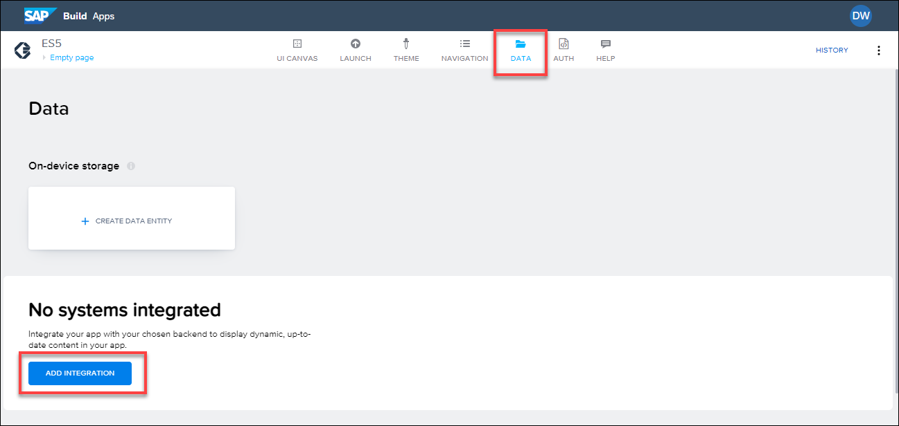

2. Click **BTP Destinations**.
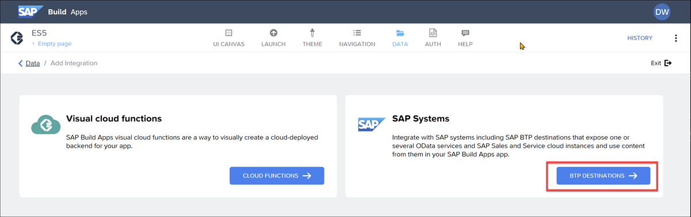

3. Select your ES5 destination.
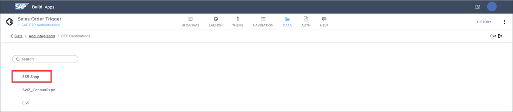

4. Click **Install Integration**.
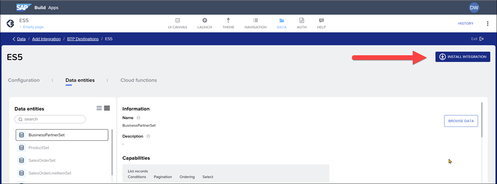

 Select the ```Product``` entity on the left, and click **Enable Data Entity** on the right.
 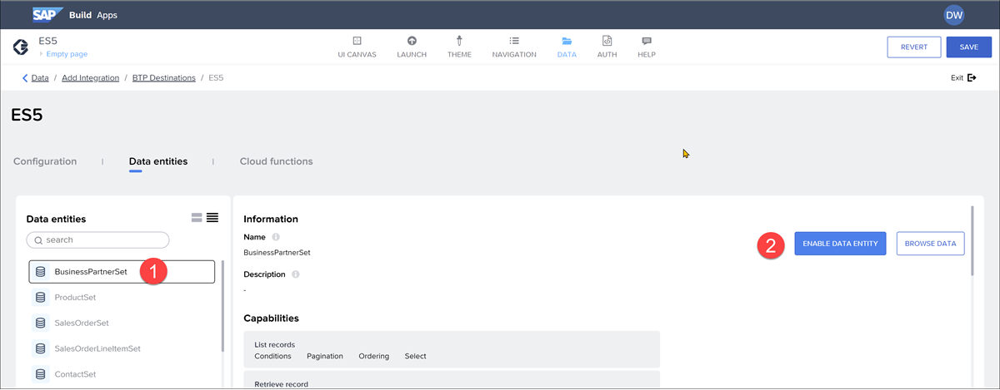

5. Click **Save** (upper right).
## Step 3
**Create data variable**
After retrieving the data, we need a place to put it,fields.

1. Click **UI Canvas**, and then click **Variables.**
 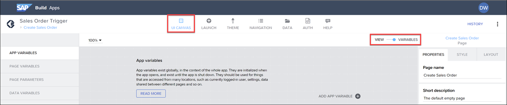

2. On the left, click **Data Variables**
   Then click **Add Data Variable**and select ````Product````.
 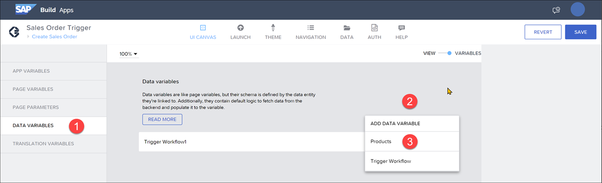

3. Click on the new variableand open the logic pane by click on **Create sales order** at the bottom of the page.
 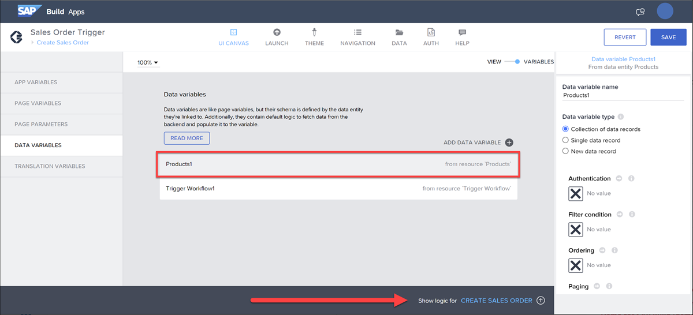

4. Click on the **Delay** flow function, and delete it by clicking the **X**.
 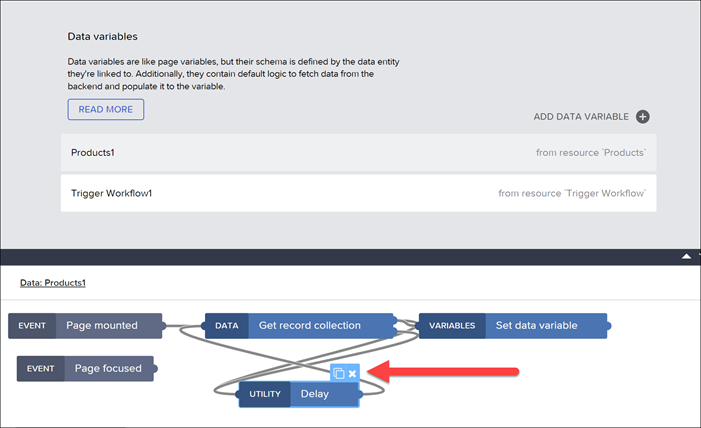

5. Click on the new variable again, and on the right-side of the page, go to **Paging** and click on the **X**, and then click **Object with properties**.
 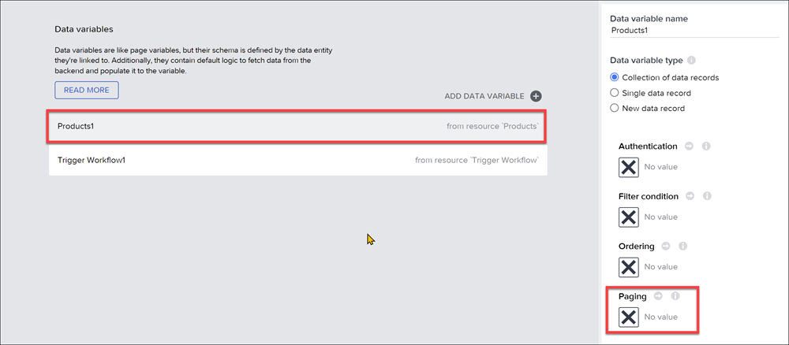

For **Page size**, click the **X**, select **Static number**, and change the number to ````10````.
For **Include total count**, click the **X**, select **Static true/false**, and change the value to ````True````.
 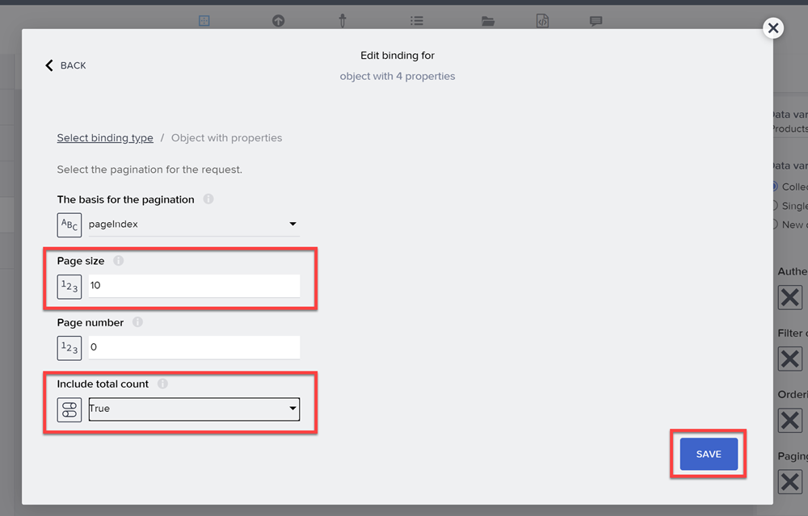

Click **Save**.

6. Click **Save (upper right**).

## Step 4
## Create dropdown for materials
1. On your **Create Sales Order** page, go back to UI canvas by clicking View.

> You can close the logic pane if it interferes with your work.

2. Drag a dropdown field next to the input box for the **Material**.
 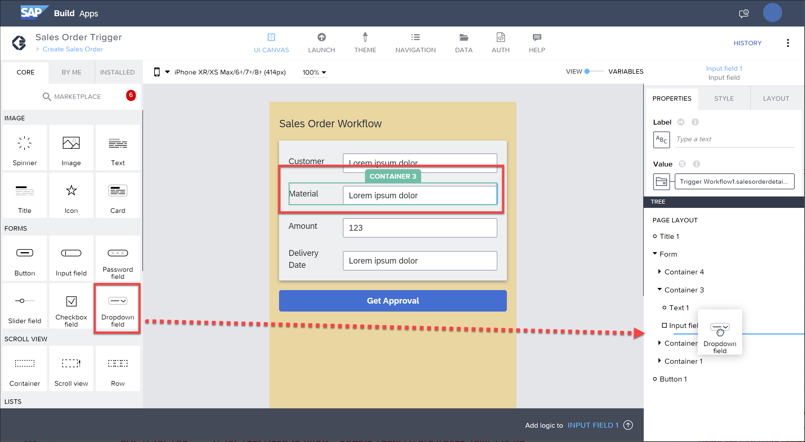

  It should look like this.

   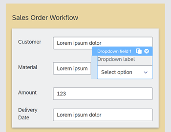

3. Click on the dropdown box, and change the following properties.

 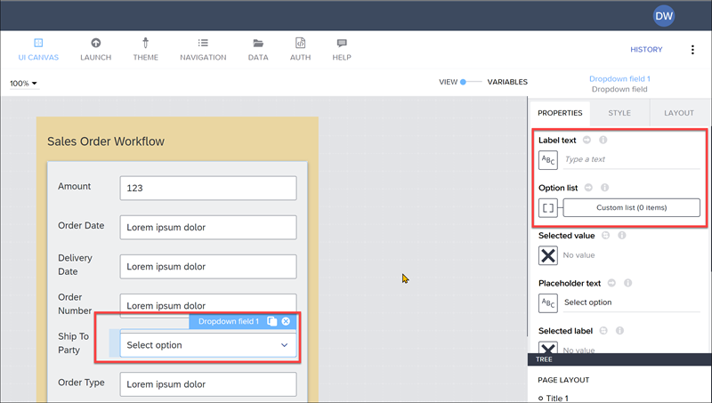
 
| Field  | Value |
| ------------- | ------------- |
| Label text  | Delete ``` Dropdown label ```  |
| Option list  | Click the list of values icon, and set the binding to a formula, and set the formula to the following: ``` MAP(data.Products1, {label: item.Name, value: item.Id}) ```|

4. You will have to bind the dropdown field to the ```Trigger Workflow1 ``` data variable (as we did for the input field for material).

For the **Selected value** field, set the binding to: **Data amd variables > Data variable > Trigger Workflow1 > material**.

 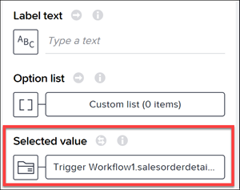

5. Click **Save** (upper right)


## Step 5
## Run app
Run app

If you already have a browser tab open to the web preview, it will refresh whenever you save the project.

Otherwise, to run the app, go to the **Launch** tab, then **Open Preview Portal > Open web preview**, and then click **Open** for the ```Sales Order Trigger``` project.

1. Enter the following values in your form:

| Field  | Value |
| ------------- | ------------- |
| Customer |  ``` Dinah's Bikes ```  |
| Amount  | ```2000``` |
| Delivery Date |```2023-04-01```|

For the material, select ``` Notebook Basic 15 ``` from the dropdown for the material – one of the products from the ES5 system.

This will also update the text field with the ID for the product.

 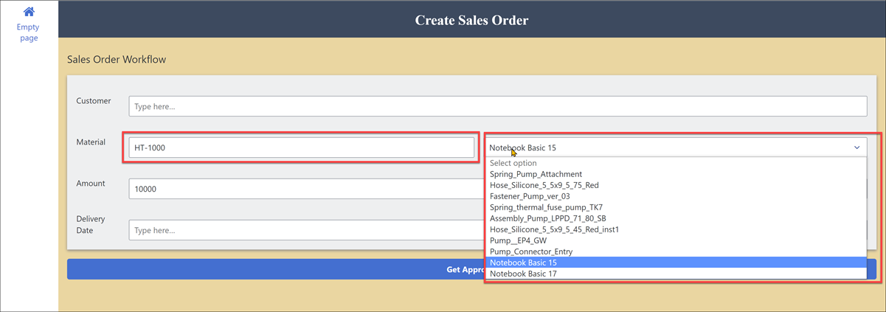

Click **Get Approval** to trigger the workflow.

Go to the **Monitor** tab, and you should see your instance, showing the ```orderAmount``` of 10000 and the ```material``` as HT-1000.


**What type of binding did we use to set the options for the dropdown list?**

* First item
* Second item
* Third item
* Fourth item

